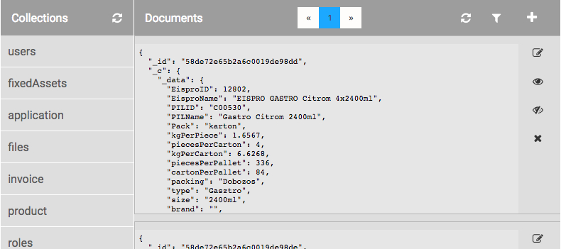

# Mi a Cognityv?

A Cognityv rendszer egy webes, mobilos (android & iOS), backend és IoT alkalmazások készítését, és üzemeltetését biztosító rendszer. Az alkalmazások felhasználói felületének, valamint a működéshez szükséges logikáinak megalkotásához is saját grafikus szerkesztőink áll rendelkezésre.

## Milyen alkalmazások készíthetők?
A jelenlegi két fő irány a webes, és a mobilos alkalmazások.

1. **Webes alkalmazás** - Internetes böngészőben, weboldalként elérhető alkalmazás. Reszponzív dizájn lehetőségeknek köszönhetően bármilyen eszközre, illetve képernyőméretre optimalizálható.

1. **Natív telefonos alkalmazás** - Kisebb képernyővel rendelkező eszközökre, nem csak az előbbi dinamikus lehetőségek szolgálnak megoldásként, hanem teljesen natív **Android**, és **IOS** alkalmazás is készíthető.

## Eszközök
A Cognityv rendszer számos technlógiát foglal magába, és bocsát rendelkezésre azonnali alkalmazásra. A legfontosabbak:
* adatbázis használat - _MongoDB_,
* felhasználó kezelés - _saját, a teljes cognityv rendszert felölelő felhasználókezelés_,
* jogosultsági rendszer - _szerepkörök_,
* adat migráció - _MySQL, és MSSQL adatbázisokból_,
* levelezés - _Emailek, levelezőlisták_,
* cron - _ütemezett feladatok_,
* fájlkezelés - _Amazon AWS, fájlok tárolása, kiszolgálása_,
* számlázást megvalósító funkciók,
* online bankkártyás fizetés - _Barion_,
* közösségi média - _Facebook login és posztolás_,
* e2e, és unit tesztelési lehetőség,
* IoT - _rendszerrel együttműködő hardver_.

Mobilos környezetben:
* kamera - _fotó, videó készítése a beépített kamerákkal_,
* QR kód - _QR-, és vonalkód beolvasás_,
* geolokáció - _eszköz földrajzi helyzetének lekérése_,
* vibráció - _visszajelzés a felhasználónak_,
* Push notification

## Lehetőségek
Igen sokféle igény kiszolgálására alkalmas a rendszer: a legkisebb, legyegyszerűbb feladatoktól kezdve (_statikus, egyszerű dinamikus, pl. időpont regisztrációs app_) a komplex rendszerek megalkotásáig (_pl. projekt management, logisztika_) ideális környezet.

A legújabb szerver technológiák által nagyobb kihasználtságot is ki tud szolgálni.

# Hogyan épül fel egy alkalmazás?

## Az akalmazás szerkezete


1. Felhasználói felület - _webes, vagy Android-os/IOS-es_
1. Logikai réteg - _vagy adat réteg. Feladatai:_
  * _a héttérből beszerzett adatok előkészítése a felhasználói felület részére,_
  * _felhasználói akciók kezelése,_
  * _adatok visszajuttatása a háttérbe_.
1. Cognityv háttér - _az alkalmazások alapjául szolgáló réteg, szolgáltatásokat nyújt, mint:_
  * _adatbázis,_
  * _fájl rendszer,_
  * _felhasználókezelés_.

## Felhasználói felület
[ábra 3] - Group, Screen, Component

A teljes app képernyőkre van osztva funkcionalitás szerint. A képernyőket Screen-eknek nevezzük, ezek Group-okban vannak csoportosítva. A Group-oknak ezen kívül más szerepük nincs. Egy képernyőn Component-ek vannak, ezek a legkisebb részegységek.

### Screen
Egy képernyő egy Screen-t jelent. Az alkalmazás minden fő funkciójának külön képernyőn érdemes megjelennie. Páldául egy TODO alkalmazás esetében:
* Bejelentkező képernyő,
* TODO lista,
* TODO szerkesztő,
* fiók karbantartás.

### Component
A Screen-en minden Component formában kap helyet. Néhány példa a legegyszerűbb, és komplexebb komponensre:
* Label - _címke, egy szöveg megjelenítésére szolgál_,
* Picture - _kép_
* Chart - _egy adathalmaz alapján grafikont jelenít meg, ez már nem elemi szintű, hanem összetett komponens_,
* File upload - _fájl feltöltő gomb, a fájl fedolgozására szerver oldali része is van_.

A komponensek típusai:
* Layout - _Elrendezést szabályozók, például:_,
  * Container - _egyszerű blokk, meghatározható a mérete, és a benne található komponensek elrendezési iránya, mikéntje_
  * Table - _táblázat_,
  * Tabs - _klasszikus tab panel_,
* Interaction - _felhasználói interaktivitást lehetővé tevők, páldául:_
  * Button - _nyomógomb_,
  * Link - _webes navigálást lehetővé tevő HTML elem_,
* Presentation - _TODO?, például:_
  * Progress - _töltő csík_,
  * Slide show - _úszó képek_
* Data input - _adatbeviteli elemek, páldául:_
  * Textbox - _sima HTML szövegmező_,
  * Time picker - _időpont kiválasztó_,
  * Slider - _csúszka_,
* Data output - _adatmegjelenítők, például:_
  * Label - _szöveges, vagy más típusú adat megjelenítése_,
  * Chart - _adatok grafikonon való szemléltetése_

#### Properties
A komponensek tulajdonságai. Minden komponensnek vannak **egyedi**, mivoltát meghatározó tulajdonságaik. Ilyen például a Label Text tulajdonsága, ami meghatározza, hogy a címke milyen szöveget jelenítsen meg. Ezeken kívül vannak a **megjelenést** meghatározó tulajdonságok, ezek a CSS beállításoknak felelnek meg, többek között a következő csoportjaik vannak: Background, Size, Padding & Margin, Position, stb...

### Példák

Container
Label

### Template
A Screen-ek közös részeit, mint amilyen egy fejléc, vagy egy menü lehet, Template-ekbe lehet szervezni, hogy ugyan azt a Component halmazt használhassa  több Screen. Tehát a Template Component-ekből áll.

Egy Screen egy Template-re épülhet rá. A Screen létrehozásakor lehet meghatározni, hogy használjon-e Tamplate-et, és melyiket, vagy sem.

## Állapot (State) réteg
[ábra 5.1]

A State réteg tartalmazza egy Screen pillanatnyi állapotát. Ez egy elméleti réteg, egy adat objektum. A UI mögötti adat, ami befolyásolhatja a megjelenést, és amit a UI megjeleníthet.

## Logikai réteg
[árba 2]

A logikai réteg Action-ökből, Function-ökből, és Node-okból áll.
Az alkalmazásban mindig valamilyen akcióra történik valami. Például a bejelentkező képernyőn a "Bejelentkezés" gombra való kattintáskor lefut egy Action, ami megkísérli a bejelentkezést: a képernyő állapotából kinyeri a felhasználó által beírt bejelentkezési adatokat, majd azt továbbítja a háttér felé. Ha sikerült a bejelentkezés, akkor a felhasználót továbbítja a következő képernyőre, ha nem, akkor a háttértől kapott hibaüzenetet elhelyezi a State-ben, hogy az megjelenhessen a képernyőn.

### Action
Egy eseményre elvégezni kívánt műveleteket Action-ökben határozhatunk meg. Az Action-t lehet eseményekhez köti, ilyenek például egy képernyő betöltődését megelőző esemény, a képernyő egy elemére való kattintás, vagy a mobil kamera sikeres QR-kód beolvasása, vagy akár CRON által előidézett esemény.

A leggyakrabban használt Action triggerelni képes események:

* onClick - _kattintás_,
* onChange - _egy komponens értékének megváltozása_
* onLoad - _egy képernyő betöltődése előtt a szerveren fut le_
* onLoadLocal - _egy képernyő betöltődése után a kliensen fut le_
* onResize - _a képernyő mérete megváltozott_
* onBarcode - _kamera komponens sikeresen beolvasott egy vonalkódot_

Egy Action be-, és kimenete mindig a képernyő állapota, azaz a **State**. Futása alatt abból dolgozhat, és bárhogy megváltoztathatja azt.

[ábra 5.2]

Ezek valamilyen feladatot látnak el, mint függvények. Egy onLoad Action-nek rend szerint az a hivatása, hogy valamilyen adatot beszerezzen valahonnan, és transzformálja ha szükséges, hogy aztán a felhasználói felületen megjelenhessen.

#### Futás helye
Egy Action különféle környezetben futhat le. Egy motor szükséges ahhoz, hogy egy Action el legyen végezve. Önmagában teljesen mindegy, hogy egy mobiltelefon, a kliens PC-je, vagy a szerver processzorja dolgozik az Action végrehajtásán.

Persze nem teljesen mindegy, ez attól függ, hogy mi az Action feladata, mely környezet valamilyen szolgáltatására van szükség ahhoz, hogy a feladat sikeresen elvégezhető legyen. A futás helye tehát lehet:

* Szerver - _adatbeszerzés az adatbázisból, fájl mentése, email elküldése, stb_
* Natív - _okostelefon: az eszköz egy helyi szolgáltatásának használata, pl. kamera_
* IoT - _Rasberry PI hardver: pl. egy hőmérő szenzor értékének lekérése_
* Web kliens - _böngésző: webes alkalmazás esetén, olyan egyszerű művelet elvégzéséhez amihez nincs szükség a háttér rendszer szolgáltatásaira, (ilyen például matematikai művelet, vagy adat transzformáció), nem optimális a szervert dolgoztatni: az alkalmazást, és az egész rendszert is lassíthatja, ha nem helyben fut le az Action._

A logikai réteg tehát minden platformon jelen van.

[ábra 11]

##### Skip history
Action létrehozásánál azon kívül, hogy a Kliensen, vagy a Szerveren fusson-e, van lehetőség ezeknek a **Skyp history** változatát kiválasztani. Ez weben annyit jelent, hogy az Action lefutása után nem változik meg az URL. Azaz a böngészési előzményekbe nem kerül be, a vissza gomb nem az Action lefutása előtti állapotra dob vissza, hanem az az előttire.

Ez kritikus műveletek elvégzésénél ajánlott, például egy mentésnél. Ezzel megakadályozható, hogy a mentés ismértelten megtörténjen, ha a felhasználó az előzményeiben lépked.

Apróbb műveleteknél is hasznos, például Ha egy űrlapra léptetjük a felhasználót, ahol egy számlálót kell léptetnie, akkor a böngésző vissza gombjától elvárt viselkedés nem a számláló értékének visszajátszása, hanem az űrlap előtti képernyőre való ugrás.

### Node
Egy Action egymás után kötött Node-okat foglal magába. A Node-ok mind valamilyen elemi szintű műveletet hajtanak végre, és azt az elrendezésükből adódó sorrendben teszik. Adatot kapnak, valamit csinálnak vele, és tovább adják az eredményt.

#### A Node-ok típusai
A Node-okat a feladataik jellege alapján csoportosítjuk az alábbi kategóriákba.
>Néhány esetben konkrét Node-ok is bemutatásra kerülnek a csoportosítási rendszer könnyebb átlátása érdekében.

* Core - _alapvető, környezetfüggetlen funkciók_
 * Array - _tömb műveletek, mint Concat, Join, IndefOx, stb..._
 * Basic - _általánosalapműveletek, mint Actionentry, -exit, Get (_
   * Action - _Actoinentry, -exit, Input, Output, Embedded_
   * Alapvető műveletek - _Get, Set, Delete, Random_
   * [...]
 * Complex - _bonyolult objektum műveletek_
 * Date
 * Logic
 * Math
 * Mqtt
 * Object
 * String
* Server - _csak a szerveren futó Action-ökben lehet használni_
 * Auth - _felhasználókezeléssel, és jogosultságokkal kapcsolatos funkciók_
 * Email
 * Files
 * Google
 * Graph //TODO
 * Invoice - _Számlázással kapcsolatos funkciók_
   * Invoice HU - _beadott adatok alapján NAV által elfogadott számlát generál_
   * Extractinvoice - _NAV szabályainak megfelelő, hivatalos XML-t generál_
   * [...]
 * Messaging //TODO
 * Mongo - _adatbázis műveletek_
 * Payment - _Online fizetés megvalósításához szükséges funkciók_
 * Pdf - _PDF generálás_
 * Social - _Facebook post_
 * Tensorflow
 * Web
   * fetch - _meghív egy URL-t, és vsszaadja a kapott adatokat_
   * Iso List - _ISO szabványnak megfelelő listák kérhetők le, pl. országok, pénznemek_
   * Iso Translate - _ISO kódot fordít le pl országnévre, vagy pénznem betűjelére_
   * Parse template
   * Rss reader
   * Toxml - _adat XML formátumba való átalakítása_
   * [...]
* CLI - //TODO ?
 * Aws
 * Commands
 * Docker
 * Files
* IoT - _Raspberry PI hardwer-en futó Action-ön használható_
 * Action
 * Gadget
 * Utils
 * Webcam
* Native - _Mobilon (Android/IOS) futó Action-ben használható_
 * Storage - _az eszköz lokális tárolójának (LocalStorage) írása, olvasása_
 * Action - _az eszköz valamilyen funkciójának használata_
   * Capture - _kamerakép, vagy videó készítése_
   * Getlocation - _földrajzi helyzet lekérése_
   * Vibration - _telefon rezegtetése_
   * [...]
* Web - _Webes böngészőben futó Action-ben használható_
 * Actions
 * Storage - _böngésző LocalStorage használata_

#### A Node felépítése

[ábra - node felépítése]

1. fejléc - _a node típusa_,
1. bemeneti port - _ezen keresztük kapja meg azt az adatot, amin, vagy ami segítségével műveletet fog vgérehajtani_,
1. kimeneti port - _ezen keresztül érhető el az eredmény_

#### Statikus / dinamikus bemenet
A bemeneti portokon keresztül kaphat statikusan, vagy dinamikusan adatot a Node.

[ábra statikus / dinapikus port]

1. Statikus - _manuálisan meghatározott érték, nem fog változni futás közben_,
1. Dinamikus - _egy másik Node kimenetét bekötve a ststikus értékadás lehetősége megszűnik, futás közben fog csak kiderülni, hogy milyen értéket kap a Node_

#### Néhány pálda
Minta&nbsp;&nbsp;&nbsp;&nbsp;&nbsp;&nbsp;&nbsp;&nbsp;&nbsp;&nbsp;&nbsp;&nbsp;&nbsp;&nbsp;&nbsp;&nbsp;&nbsp;&nbsp;&nbsp;&nbsp;&nbsp;&nbsp;&nbsp;&nbsp;&nbsp;&nbsp;&nbsp;&nbsp;&nbsp;&nbsp;&nbsp;&nbsp;&nbsp;&nbsp; | Leírás
:--- | :---
 | A String **Length** Node egy szöveget kap, és annak hosszát adja tovább. A Kimenet `6` lesz.
 | A **Simple add** Node két számot kap, és az összegüket adja tovább. A kimenet `2` lesz.
 | A **Get** node arra való, hogy egy objektum valamelyik értékét elkérjük. Három bemenete van, az `input` egy objektum, a `path-1` annak a tulajdonságnak a neve, amelyiket szeretnénk megkapni az objektumból, hogy aztán további műveleteket végezhessün kvele. A `defaultValue` az az érték, amit abban az esetben szeretnénk visszakapni, ha az objektumban nincs meg a kívánt elem. A kimenet `1` lesz.

#### Port többszörözés
Vannak olyan Node-ok, ahol van lehetőség bemeneti port-ot többszörözni.

Minta&nbsp;&nbsp;&nbsp;&nbsp;&nbsp;&nbsp;&nbsp;&nbsp;&nbsp;&nbsp;&nbsp;&nbsp;&nbsp;&nbsp;&nbsp;&nbsp;&nbsp;&nbsp;&nbsp;&nbsp;&nbsp;&nbsp;&nbsp;&nbsp;&nbsp;&nbsp;&nbsp;&nbsp;&nbsp;&nbsp;&nbsp;&nbsp;&nbsp;&nbsp; | Leírás
:--- | :---
 | A **Simple add** Node nem csak két számot képes összeadni, hanem igény szerint bármennyit. A kimenet `3` lesz.
 | A **Get** node `path-` input portja többszörözhető, hogy egy objektumból egy Node segítségével több adatod is ki lehessen választani. Ebben, -és hasonló esetekben a bemeneti port többszörözésével a kimeneti port-ok is szaporodnak. A `result-1` kimenet az objektumnak azt az értékét fogja visszaadni, amelyik az `input`-ban megadott objektum `path-1`-ben megadott névnek megfelelő tulajdonságának értéke. Jelen esetben `1`. Ha feltételezzük hogy az `input`-ban megadott objektum `price` tulajdonságának értéke `100`, akkor ez lesz a `result-2` kimeneten.

A port többszörözést olyan bemeneti portokon lehet elvégezni, ahol a port neve végén kötőjel, és szám található `number-1`, `path-1`, `date-1`, stb...

Mindezt a bemeneti porton való `alt` billennyű nyomvatartásával egyidejű kattintásra felbukkanó ablakban lehet állítani.

#### Útvonalak
A **Get**, a **Set**, és más Node-ok esetében amikben egy objektum egy elemére lehet hivatkozni, tübb féle képpen lehet megtenni a címzést, többszörös mélységben is.

Ha a State a következő, ahol több szintű az objektum strukturája, és tömb is szerepel:

```json
{
  "property1": "value1",
  "property2": {
    "property3": "value3",
    "property4": [
      {
        "property5": "value5"
      }
    ]
  }
}
```

A **Get** Node `path-n` portjainak a következő féle módokon lehet értéket adni:

Minta | Leírás
:--- | :---
`"property1"`|Egyszerű szöveges címzés, az eredmény: `"value1"`
`"property2.property3"`|Több szintű sz9veges útvonal, az eredmény: `"value3"`
`["property2", "property4", 0, "property5"]`|Több szintű útvonal, az elemek tömbben megadva. A tömb indexe szám, az object tulajdonságnevei szövegesek. Az eredmény`"value5"`

### Action és Node-ok működése
Egy Action felfogható egy **adatfolyamként**. Az Action láncba kötött Node-okból áll. Az Action-ön, és a Node-okon is szabályozott sorrendben átfolyik az adat, ami közben átalakulhat, és további folyamatok indulhatnak el.

Az Acton-nek van bemenete, és kimenete, ezek is Node-ként jelennek meg.

Minta&nbsp;&nbsp;&nbsp;&nbsp;&nbsp;&nbsp;&nbsp;&nbsp;&nbsp;&nbsp;&nbsp;&nbsp;&nbsp;&nbsp;&nbsp;&nbsp;&nbsp;&nbsp;&nbsp;&nbsp;&nbsp;&nbsp;&nbsp;&nbsp;&nbsp;&nbsp;&nbsp;&nbsp;&nbsp;&nbsp;&nbsp;&nbsp;&nbsp;&nbsp; | Leírás
:--- | :---
 | Az Action belépési pontja az **Actionentry** Node. Három portja szolgáltat különféla adatokat. <br>`state`: a képernyő állapota, <br>`user`: a bejelenekezett felhasználó adatai, <br>`trigger`: az action meghívódásához kapcsolódó adatok, lásd később.
 | Az Action kilépési pontja az **Actionexit** Node. <br>`state` porton keresztül adható át az az adat, amit a Screen State-jének kívánunk beállítani. <br>`screenID`-val lehet meghatározni, hogy mely Screen legyen a következő. <br>`actions`: különféle akciók futtathatók le a Screen-en.

#### Screen váltás

Az Actionexit Node `screenID` értékének különböző beállításaival a következőket lehet elérni:
* `null`: _nem változik a képernyő, az Action lefutása után az aktuális képernyő alatt módosítható a State_
* egy másik Screen megadása: _a kliens az Action lefutása után egy másik képernyőre kerül át_
* az aktuális Screen megadása: _oldalfrissítésnek fogható fel, a Screen onLoad Action-je le fog futni._

A Actionexit `state`, és `action` portjain keresztül minden esetben továbbjut az adat.

#### Screen actions

Az Actionexit `actions` portján át utasítások adhatók át a következő Screen-nek különféle akciók elvégzésére. Például a **Poptoast** Node ide kötésével felugró üzenet jeleníthető meg, vagy a **Login** Node-dal kijelentkezethetjük a felhasználót.

#### Példa
A következő példában egy Action látható, és a benne szereplő összekötött Node-ok. A példa egy számlálót növelő gomb Action-jét mutatja be. A State-ben tárolódik a számláló állapota: `{ number: 0 }`.


A következő történik:
1. A belépési ponton: **Actionentry** elkérhető az Action-t lefuttató Screen pillanatnyi State-je.
1. A **Get** Node a teljes State-ből vissza adja a `number` tulajdonságot.
1. A **Simple add**, azaz egyszerű összeadás Node a kapott értéket megnöveki egyel, és azt adja ki.
1. A kapott számot a **Set** Node-dal beállítjuk abba az objektumba, ami az Action indulásának a pillanatában a Screen állapotaként jött be. Ezzel felülíródott az ugyan azon a néven szereplő szám.
1. A módosított objektumot az **Actionexit** segítségével visszajuttatjuk a Screen-nek State-ként.

### Function

Van lehetőség olyan függvényt létrehozni, ami nem egy eseményre fut le, hanem egy Action, vagy egy másik Function hívja meg valamilyen módon. Ezek a **Function**-ök. Ezek be-, és kimeneti Node-ja a sokkal egyszerűbb **Input**, és **Output**.


A Function-öket az alább tárgyalt módokon lehet ezeket alkalmazni.

#### Beágyazott logika
Egy összetettebb műveletet érdekes - sőt ajánlott kisebb részegységekre bontani. Ez növeli az áttekinthetőséget, a javíthatóságot, és a továbbfejleszthetőséget.

A függvényeket **Embedded** nevezetű Node segítségével lehet beágyazni.

A következő példa egy számla kiállításának folymatát mutatja be.


Három függvény van beágyazva. Mind megkapja, és továbbadja a State-et.

1. A számla legenerálása - _számlaszám generálás, és rögzítés, pdf generálás_,
1. raktárkezelés - _kiszámlázott termékek levonása a készletből_,
1. levelezés - _email-ek elküldése_.

Minden függvénynek meg van a maga felelősségi köre.

#### Iteráció
Abban az esetben, ha egy sorozat elemein kívánjuk elvégezni ugyan azt a műveletet, szintén a függvények jelentik a megoldást.

A következő példában a számla összes tételén egyenként ki kell számolni a nettó árból, és az áfa alapból a bruttó árat.


1. A tételeket tartalmazó tömb kiválasztása,
1. a **Map** Node `input` portján át megkapja az elemek tömbjét, és minden elemére lefuttatja a `functionid` nevű portján kiválasztott függvényt.
1. A **Map**-en belül mindig a tömb egyik elemét lehet elérni, és azon műveletet végezni. Így kerül kiszámításra a bruttó ár minden egyes tételnél klön-külön.
1. A **Map** a módosított tömböt adja eredményül, ezt a **Set** Node segítségével behelyettesítjük a State-be.
1. A frissített State-objektumod kiadjuk a Screen számára az **Actionexit** Node-on keresztül.

Egy tömb elemeire egy függvényt meghívni a **ForEach**, és a **Map** Node-okkal lehet. A **Reduce** Node segítségével az elemeknek valamely tulajdonságát, valamilyen logika alapján lehet összeszámolni.

### Elágazások
Gyakran előfordul, hogy egy bizonyos feltétel szerint kell elvégezni egyik, vagy másik műveletet. Ilyenkor az Action-nek lesz olyan része, ami kimarad a futásból. Ezt nevezzük **halott** ágnak, míg az összes többi, a futásban résztvevő részeket **élőnek**.

**FIGYELEM!** Élő ágat sosem szabad halott ággal keverni. Azaz az egyik ág egy Node-jának kimenete nem köthető be a másik ág egy Node-jának bemenetébe. Ilyenkor futás közben előfordulhat, hogy egy nem létező értéket vár egy Node, így az Action le fog állni.

#### If
A legalapvetőbb Node az **If**, amivel elágazást lehet összeállítani.

Minta&nbsp;&nbsp;&nbsp;&nbsp;&nbsp;&nbsp;&nbsp;&nbsp;&nbsp;&nbsp;&nbsp;&nbsp;&nbsp;&nbsp;&nbsp;&nbsp;&nbsp;&nbsp;&nbsp;&nbsp;&nbsp;&nbsp;&nbsp;&nbsp;&nbsp;&nbsp;&nbsp;&nbsp;&nbsp;&nbsp;&nbsp;&nbsp;&nbsp;&nbsp; | Leírás
:--- | :---
 | A `data` input értéke egy az egyben tovább halad, de csak az egyik irányba. A `condition` input logikai érték, ha ez `true`, akkor az `iftrue` ág halad tovább, különben az `iffalse`

Az alábbi példában az `Űrlap` Screen-en bekért adatok ellenőrzése után meghívjuk a `Mentés` Functin-t, vagy hibaüzenetet kap vissza a felhasználó az oldlaon maradva.


1. A **Get** Node segítségével kiválasztjuk a `name`-et a State-ből.
1. Az **Equals** Node segítségével megvizsgáljuk, hogy a `name` egyelnő-e egy nulla hosszúságú szöveggel - _azaz a felhasználó beírt-e bármit is_.
1. Az **Equals** egy logikai értéket ad vissza: `true`-t, ha a `name` egy üres szöveg, `false`-t, ha nem.
1. Az **If** `data`-ként a State-et kapja, azaz a `condition`-ben megkapott érték szerint ezt fogja továbbítani a megfelelő irányba.
  1. Ha `name == ""`, akkor az **If** `condition`-je `true`-t kap, tehát az `iftrue`-n megy tovább az adat. Ott egy **Set** segítségével a State-be beállítunk egy `error` tulajdonságot amit meg lehet jeleníteni a Screen-en, majd a jelenlegi `Űrlap` Screenre lépünk ki.
  1. Ha a `name` nem egy üres szöveg, akkor az **If** `condition`-je `false`-t kap, tehát a State az `iffalse` irányba jut tovább. Egy **Embedded** Node segítségével az adatot megkapja a `Mentés` függvény, majd utána a `Lista` képernyőre lépünk ki.

#### Endif

Minta&nbsp;&nbsp;&nbsp;&nbsp;&nbsp;&nbsp;&nbsp;&nbsp;&nbsp;&nbsp;&nbsp;&nbsp;&nbsp;&nbsp;&nbsp;&nbsp;&nbsp;&nbsp;&nbsp;&nbsp;&nbsp;&nbsp;&nbsp;&nbsp;&nbsp;&nbsp;&nbsp;&nbsp;&nbsp;&nbsp;&nbsp;&nbsp;&nbsp;&nbsp; | Leírás
:--- | :---
 | A `thread-1`, `thread-2`, `thread-n` input portokba azokat a szétválasztott szálakat kell bekötni, amik közül biztos hogy csak egy fut le. Az `active` output porton az a bekötött adat fut tovább, amelyik a bemeneten élő volt.

Az elágaztatott szálakat összefogását mutatja be a következő példa.


1. Az `isNew` változóbó mutatja, hogy az elmentendő dokumentum új-e, vagy már egy létező,
1. ez alapján az **If** után vagy a `Felülírás`, vagy a `Beszúrás` függvény fut le ugyan azzal az `input`-tal.
1. Miután lefutott a megfelelő függvény, a két lehetséges szálat összefogjuk az **Endif** Node-dal. Az után mindegy hogy valójában melyik futott le, egy szálon fut tovább a Function.

Az **Endif** nem csinál mást, csak továbbítja a bejövő adatot. A bemenetei közül egy lehet élő. (Azaz vagy az egyik, vagy a másik szál futott le előtte). Azt a bemenetet továbbítja kimenetén, amelyik élő volt.

#### Router

Ide sorolható, komplexebb, több funkciós Node a **Router**.
A programozásból ismert `switch` szerkezethez hasonlítható.

Minta&nbsp;&nbsp;&nbsp;&nbsp;&nbsp;&nbsp;&nbsp;&nbsp;&nbsp;&nbsp;&nbsp;&nbsp;&nbsp;&nbsp;&nbsp;&nbsp;&nbsp;&nbsp;&nbsp;&nbsp;&nbsp;&nbsp;&nbsp;&nbsp;&nbsp;&nbsp;&nbsp;&nbsp;&nbsp;&nbsp;&nbsp;&nbsp;&nbsp;&nbsp; | Leírás
:--- | :---
<br><br>Több feltétellel:<br> | `trigger`: az ide beérkező adatot vizsgálja <br>`condi-1`: az első feltétel, ezzel hasonlítja a `trigger`-t <br>`data-1`: ha a `trigger` és a `condi-1` megegyezik, az itt kapott adatot fogja továbbítani <br>`defaultData`: ha a `trigger` nem egyezik egy feltétellel sem, akkor az itt kapott adatot továbbítja. <br><br>A `condi-1`-`data-1`-`case-1` hármas többszörözhető, azaz több feltétel is megadható.<br><br>Az alábbi kimenetek közül minden esetben két élő lesz. A teljesült feltételhez tartozó kimenet, és a `live`.<br><br>`case-1`: ha az első feltétel teljesült `trigger===condi-1`, akkor erre halad tovább a futás a `data-1` adatával <br>`defaultCase`: ha nem teljesült egy feltétel sem, akkor a futás erre folytatódik a `defaultData` adatával <br>`live`: bármi is lett az eredmény, az ahhoz tartozó adat forrás (`data-1`/`data-1`/`defaultData`) itt élve távozik.

Két különböző felhasználási mód következik.

##### Kiválasztás


A fenti példában a `currency` értéke szerint határozzuk meg a `label` értékét. A **Router** kimeneti portjai közül csak a `live`-val foglalkozunk. Ha a `currency` értéke megfelel valamely, a `condi-1`, vagy a `condi-2`-ben megadott értékkel, akkor az eredmény `HUF`, vagy `EUR` lesz. Különben `Ismeretlen`.

##### Útelágaztatás

A fenti példában egy számot elosztunk kettővel, amennyiben az nem nulla. A `trigger`, a `defaultData`, és a `data-1` is ugyan az az, a `number` értéke lesz. A `live` ággal most nem törődünk, most az a fontos, hogy a feltétel teljesült-e, vagy sem.

### Jótanácsok
A legjobb minden logikát Function-ökben megvalósítai. Az Action-ökben pedig ezeket az egységeket meghívogatni.

A Node-ok mindig balról jobbra, a folyamnak megfelelő sorrendben helyezkedjenek el, amennyire ez lehetséges.

hogyan lehet átlátható, javítható, továbbfejleszthető action/function rendszert készíveni?

## A rétegek együtt
A Screen és a Component rendelkezik Action-ökkel. [ábra 4]

Egy képerynő betöltődése előtt lefut az onLoad esemény, amihez hozzárendelt Action-ben lehetőség van a háttér réteg funkcióit használva adatokat beszerezni, vagy egyszerűen csak inicializálni a felhasználó felület. Egy gomb megnyomására lefut az onClick esemény, amihez egy Action-t rendelve összegyűjthetjük a felhasználói felületre beírt adatokat, megfelelő állapotra hozva továbbíthatjuk a háttér felé.

### State tag
Egy komponens bármely Property-je dinamikussá tehető. Összelinkelhető a State egyik tulajdonságával. A módosítás két irányú, azaz
* ha a State-ben megváltozik az adat, akkor a képernyőn is frissül a hozzá kötött rész
* ha egy beírómező hozzá lett kötve a State-hez, akkor ahogy a felhasználó ír, úgy az adat objektum változik.

#### Példa

A számláló növelő példa ebből a szemszögből így néz ki.
A képernyőn elhelyezkedő Taxtbox Component Value Property-je StateTag segítségével össze van kötve a State `qty` paraméterével.

&nbsp;|1. Kezdeti állapot | 2. Módosult állapot
---|:---:|:---:|:---:
UI:||
State:|`{ qty: 2 }`|`{ qty: 3 }`

1. A Textbox a `2` értéket jeleníti meg, mert a `qty` értéke a State-ben ennyi.
1. A [+] gomb megnyomására lefut egy Action, ami a State-ben a számot megnöveli egyel.
1. A képernyő automatikusan frissül, a Textbox most már a `3` értéket mutatja.

### Multiply Component

Gyakran használt, speciális Comonent a **Multiply**. Segítségével a képernyőelemek, vagy blokkok ismétlődését lehet megvalósítani. Például egy lista megjelenítésére alkalmas. A lista elemei közül csak egyetlen példányt kell összeállítani. Ezt a sort egy **Multiply** komponensben kell elhelyezni. A Multiply tulajdonságként megkapja az adat tömböt, és ahány eleme van, annyiszor fogja ismételtel megjeleníteni a saját tartalmát.

Komponens&nbsp;struktúra | Szerkesztő&nbsp;nézet | Működés&nbsp;közben
:--- | :--- | :---
||
Egy Multiply-ban egy checkbox lett elhelyezve|A szerkesztő nézetben így néz ki adat nélkül|Végül futtatva az alkalmazást, és a Multiply-nak átatva az alábbi adat tömböt, az eredmény ez.

A State a következő:
```json
{
  "todoList": [
    {
      "title": "Feladat 1",
      "checked": false
    },
    {
      "title": "Feladat 2",
      "checked": true
    }
  ]
}
```
A Multiply `Value` Parameter-e várja az adattömböt, ami szerint ismétli a tartalmát. Ezért StateTag.ként a következő lett beállítva: `Value: todoList`.

A checkbox-nak a Text Propety-je felelős azért, hogy milyen szöveget jelenítsen meg, a Value pedig az állapotát tartalmazza, azaz hogy be van-e pipálva, vagy nincs. Ezek lettek StateTag-elve: `Text: title`, és `Value: checked`. Így futás közben dinamikusan kapnak értéket a State-ből.


### StateTag látóköre

A fenti példa szerint a Multiply-ban ismétlődő komponensek a StateTag-en keresztül mindig az State azon részét érik el, ami szerint létrejöttek. Tehát az előző példa esetében:

Multiply&nbsp;egy&nbsp;eleme | Látóköre a State-ből kiragadva
:--- | :---
|`{ "title": "Feladat 1", "checked": false }`

A checkbox component StateTag-ként a `title`, és `checked` értékeket kapta, ezzel hivatkoztunk a saját látókörén belül. Ezt nevezzük `lokális` látókörnek.

Van lehetőség ezen a szűk látókörön kívülre is hivatkozni, ekkor a `globális` látókört használjuk.

Az előző példánál maradva, tegyük fel, hogy napszaknak megfelelően dinamikusan szeretnénk befolyásolni a checkbox-ok szövegének színét. Szintén StateTag-eléssel lehet megoldani, de ha a `lokális` látókörnél maradunk, akkor minden egyes TODO elem rekordjába be kéne állítani a változót.  A State így nézne ki:

```json
{
  "todoList": [
    { "title": "Feladat 1", "checked": false, "fontColor": "blue" },
    { "title": "Feladat 2", "checked": false, "fontColor": "blue" },
    { "title": "Feladat 3", "checked": false, "fontColor": "blue" },
    { "title": "Feladat 4", "checked": false, "fontColor": "blue" }
  ]
}
```

A `blue` érték itt redundánsan, többszörösen szerepel, holott az értéke garantáltan csak egy lesz. Ha száz TODO elem van, akkor százszor. Más esetben hatalmas méreteket is ölthet ez az adatfelesleg. Ezért lehetőség van arra, hogy a Multipy egy eleme a saját `lokális` látóköre helyett `globálisan` elérje a teljes State-et. Így a State a következő lehet:

```json
{
  "todoList": [
    { "title": "Feladat 1", "checked": false },
    { "title": "Feladat 2", "checked": false },
    { "title": "Feladat 3", "checked": false },
    { "title": "Feladat 4", "checked": false }
  ],
  "fontColor": "blue"
}
```

### Actionentry.trigger
Bizonyos esetekben egy Action-ben információra van szükség arról, hogy honnan lett az elindítva.
#### index
Amikor egy Multiply Component-en belül többszörözött gombra való kattintás indít egy Action-t, akkor tudni kell, hogy a sorozat mely elemén történt a kattintás.

A TODO-s példánál maradva, a checkbox onCnange eseményén belül az Actionentry `trigger` kimenete a következőt adja: `{ "index": "todoList.0" }`. A nullás szám azt jelenti, hogy a nulladik elemen történt a kattintás.

Ez az `index` közvetlenül felhasználható útvonalként az érintett rekord kiválasztásához:


#### További
Alább egy minta az **Actionentry** `trigger` értékéről:

```json
{
  "index": [],
  "id": "5901f469d0b69e18e081e18b",
  "type": "onClick",
  "env": "local",
  "position": {
    "x": 484,
    "y": 63
  }
}
```

* `index` - _feljebb kifejtve_,
* `id` - _az Action azonosítója_,
* `type` _az Action típusa_,
* `env` - _az Action futásának környezete (lehet még pl. server)_,
* `position`- _a kurzor pozíciója az esemény triggerelésének pillanatában_

# Kliens
Az alkalmazást futtatva általában vagy a webes böngészőben, vagy mobil eszközön vannak használva. Ennél fogva fejlesztés közben, és utána is ezeken az eszközökön lehet tesztelni a működésüket. Ezeknek a folyamatoknak a segítsésére szolgál a **Client dev tools**, a fejlesztői oldalsáv.


1. E2E Tests - _az E2E tesztek rögzítésére szolgáló funkciók_
1. App State - _az app state-je követhető nyomon_
1. Client Logs - _a kliensen futó Action-ök logjai_
1. Server Logs - _a szerveren futó Action-ök logjai_

Ezt előhívni weben a `ctrl + H` billenytűk lenyomásával, mobilon pedig az előlapi kamera mellett elhelyezkedő távolságérzékelő szenzor letakarásával lehet.

Feltétele még, hogy a verzió teszt módban legyen _(lásd lejjebb)_, és ha van az app-ba bejeletekezett felhasználó, akkor az teszt felhasználó legyen.

## Wrap error
//TODO

# Designer
A Cognityv rendszer rendelkezik egy grafikus alkalmazás szerkesztő résszel, ezt nevezzük Designer-nek.

## Application, Version
Bejelentkezés után az alkalmazások, és azok verzióinak kezelő felüle jelenik meg.

A verziók közül egy lehet éles, annak az URL-jében nem szerepel verziószám, és biztonsági okokból nem lehet szerkeszteni.

Verziókat lehet duplikálni, exportálni, és importálni.

//TODO settings/version?

Version-re kattintva elérhető a szerkesztő.

## View editor

A Screen-ek szerkesztésére szolgáló grafikus felület.

A navigációs menü mindig bal oldalon található.


1. Designer menü
1. Platform választó - _itt lehet váltani a különböző platformok között_
1. Navigációs oldalsáv
  1. Templates - _az aktív platformon elérhető sablonok listája_
  1. Groups - _képernyőcsoportok_
  1. Screens - _az aktív csoportban található képernyők_
  1. Components - _az aktív képernyő komponens fája_
  1. Actions - _az aktív képernyőn található akciók_
1. Szerkesztő felület - _a szerkesztés alatt álló felhasználói felület grafikusan_
  1. Szerkesztő eszközök sávja - _szerkesztő eszközök, mint visszavonás, másolás, stb_
1. Jobb oldalsáv
  1. Component hozzáadás - _a képernyőhöz hozzáadható komponensek listája_
  1. Component tulajdonságok - _a szerkesztő felületen aktív komponens tulajdonságai_
  1. State tags / Actions - _az aktív komponens StateTag-jei, és Action-jei_

### Navigációs oldalsáv

Bal oldalt lehet szerkesztése kiválasztani **Template**-et, vagy Groupt-ot, és azon belül **Screen**-t.

Alul a A kiválasztott képernyő, vagy template komponensei fa nézetben, és Action-jei.

### Szerkesztő felület

A kiválasztott képernyő, vagy template tartalma grafikusan. Az aktív komponens piros keretet kap.

#### Szerkesztő eszközök

A gyorsgombok mellett a szokásos szerkesztő eszközökez itt lehet aktiválni.
Speciális eszközök:

1. Outlines - _Segédvonalak: minden komponenst halvány segédvonal keretezi az étláthatóság érdekében. Ezt kikapcsolva pontosan úgy jelenik meg a képernyő, ahogy a kliensben fog futás közben._
1. Page settings - _képernyővel kapcsolatos beállítások, lásd lejjebb_
1. CScript - _CScript megtekintése, lásd lejjebb_
1. Edit mode, View mode - _lásd lejjebb_

#### Edit mode, View mode

Az alkalmazást valószínűleg sokféle konfiguráción fogják haszánálni a felhasználók. A variációk szinte végtelenek: képernyő mérete, böngésző típusa.

A felület reszponzivitásának fejlesztésében segít ez a két eszköz.
<br>A **View mode** grafikusan is imitálja a képernyő megtekintését más eszközön való megjelenítését.
<br>Az **Edit mode** állításával különböző konfigurációkra különböző beállításokat lehet meghatározni. Egy egyszerű példa: egy Container margin értéke 50px. Kis képernyőn ez túl sok, 10px is elegendő lenne. Az Edit mode ablakban a Screen size-t mobilra állítva felül lehet írni az eredeti margin értékét. Ettől kezdve mobil méretű képernyőkön a kliensben automatikusan 50px helyett 10px lesz a margin.

>Beállítás után egyből érdemes visszaállítani az Edit mode-ot, mert össze lehet kavarodni, ha véletlenül úgy marad.

#### Page settings

### Váltás a platformok között
Eltérő platformonként kizárólag a felhasználó felületeket, azaz a **Screeneket** kell külön kezelni. Tehát a váltásnál csak a szerkesztő felület fog változni, illetve a hozzáadható Component-ek listája.

> A mobil platform felhasználói felületének megjelenítésére csak korlátozott lehetőség van: a komponensek egyszerű blokkokkét jelennek meg, a szülő-gyermek viszonyok szerint egymásban.

### Properties

A Properties tabon láthatók a kiválasztott komponens tulajdonságai.

Minta&nbsp;&nbsp;&nbsp;&nbsp;&nbsp;&nbsp;&nbsp;&nbsp;&nbsp;&nbsp;&nbsp;&nbsp;&nbsp;&nbsp;&nbsp;&nbsp;&nbsp;&nbsp;&nbsp;&nbsp;&nbsp;&nbsp;&nbsp;&nbsp;&nbsp;&nbsp;&nbsp;&nbsp;&nbsp;&nbsp;&nbsp;&nbsp;&nbsp;&nbsp; | Leírás
:--- | :---
| A **Params** blokkban a komponens fő tulajdonságai állíthatók be. Minden beállítás dinamikussá tehető, atat **StateTag**-elhető a nevére való kattintással, ekkor a címke háttere lilává válik.<br>Ha egy tulajdonságnak van statkusan beállított értéke, akkor jobb oldalon láthatóvá válik a törlés gomb (X).<br>Jellemzőan a **Hide** beállítás minden komponensnél elérhető, akkor a kliensbe egyáltalán nem fog bekerülni.<br>A **Tag** tulajdonságnak csak a Designer-ben van jelentősége: A bal oldali Components listában, és bizonoys esetekben a szerkesztő felületen jelenik meg.<br>A **Show by role** beállítással a komponens megjelenését a bejelentkezett felhasználó egy szerepkörének meglétéhez lehet kötni.<br><br>A **Style** blokkban a kiválasztott komponens stílusa állítható. Bizonyos komponensek esetében több Style blokk van, különböző részeire vonatkozólag (pl. ikon, címke).

### State tags / Actions

A harmadik tabon lehet szerkeszteni mindent, amitől dinamikus a Screen: a kiválasztott komponens State tag-ei, és Action-jei.

Minta&nbsp;&nbsp;&nbsp;&nbsp;&nbsp;&nbsp;&nbsp;&nbsp;&nbsp;&nbsp;&nbsp;&nbsp;&nbsp;&nbsp;&nbsp;&nbsp;&nbsp;&nbsp;&nbsp;&nbsp;&nbsp;&nbsp;&nbsp;&nbsp;&nbsp;&nbsp;&nbsp;&nbsp;&nbsp;&nbsp;&nbsp;&nbsp;&nbsp;&nbsp; | Leírás
:--- | :---
| **State tags**: minden, ami a Properties tab-on lila hátterű, azaz a State tag engedélyezve van, annak itt lehet konfigurálni, hogy a State mely tulajdonságával legyen összeköttetésben a komponents adott Prop, vagy Style tulajdonsága. A **Tag** a State tulajdánságneve, a **Scope** a látókör a az előzőre (_lásd: StateTag látóköre_)<br><br>Az **Actions** blokkban a kiválasztott komponens Action indító eseményei vannak felsorolva. Ezekhez lehet újat létrehozni, vagy egy meglévőt hozzárendelni. Új létrehozásánál ki kell választani, hogy hol fusson az action: a kliensen, vagy a szerveren.

### CScript
A CScript az alkalmazás minden apró részletét leíró szöveges állomány. Az aktív képernyő CScript-jét a bal oldali nyíllal jelölt gomb megnyomásával lehet megtekinteni, az aktív komponensét pedig a jobb oldalival. Az utóbbi esetben a kézi szerkesztés is engedélyezett.

//TODO képet cserélni a JSON EDIT felirat miatt
lehet ám hogy nem is kell ide kép...


## Function editor


1. Function típus választó
1. Functions tab - _az app összes függvénye a fenti csoporton belül: fx (normál function), cli, cron, api, url_
1. Szerkesztő terület
1. Function Node Informations - _a Node típusok leírása példákkal_
1. Error logs - _futás közben történt hibák_
1. Comment box
1. Ghost connection
1. //TODO mi a neve a sárga cuccnak?
1. Kiválasztott függvény neve
1. Usage information
1. State tags
1. Kereső
1. Debug tool
1. Zoom

### Function Node Informations
A rendszerben elérhető Node típusok böngészője, és dokumentációja. A legtöbb esetében példák is láthatók a helyes, és helytenel használatra is.

### Error logs
Ha a kliens futása közben egy függvény hibásan működik, annak a lefutásának minden adata ebbe a listába kerül. Kiválasztva egy elemet pontosan visszajátszható, hogy mi történt a hibás futásban.

### Comment box
A függvény kommentelésére, és Node-ok csoportosításár szolgáló speciális doboz. Rendelkezik cím mezővel, valamint a fejléc alatti területe it írható. A _lakat_ ikonnal rögzíthetők a bele eső Node-ok, ami azt jelenti, hogy a Comment box segítségével a Node-ok csoportosan mozgathatóvá válnak. A _kör_ ikonnal megváltoztatható a box színe.

### Ghost connection
Összetettebb függvényeknél jelentősen rontani tudja az átláthatóságot a "keresztül-kasul" álló kapcsolatok vonalai. A **Ghost connection** eszközzel a kötések láthatatlanná tehetők - csak egy-egy csonk marad az elején, és a végén. Használatához aktiválni kell a gombot, majd a kapcsolat végén levő porton (input port) való kattintással lehet ki, és be kapcsolni.

### //TODO sárga cucc

### Usage information
A halvány szám azt mutatja, hogy hány helyen van alkalmazva a kiválasztott függvény. Rákattintva pontos információ jelenik meg az alkalmazás helyéről.

### State tags
Csak abban az esetben érhető el ez a funkció, ha View editorban lett megnyitva egy Action szerkesztésére a függvényszerkesztő. Rákattintva struktúráltan megjelenik az aktuális Screen összes State tag-je.

### Kereső
Keresés a Node-ok közt. A következőkre lehet keresni:

* Node neve
* Node statikus input paramétere - _például egy Get Node megtalálható a `path-1` inputjába írt szöveg alapján_
* Node azonosítója - _**Wrap error**-nál megjelenik_

### Debug tool
Hibakereső funkció, a függvény futását lehet vele ellenőrizni Node-ról Node-ra.

Minta&nbsp;&nbsp;&nbsp;&nbsp;&nbsp;&nbsp;&nbsp;&nbsp;&nbsp;&nbsp;&nbsp;&nbsp;&nbsp;&nbsp;&nbsp;&nbsp;&nbsp;&nbsp;&nbsp;&nbsp;&nbsp;&nbsp;&nbsp;&nbsp;&nbsp;&nbsp;&nbsp;&nbsp;&nbsp;&nbsp;&nbsp;&nbsp;&nbsp;&nbsp; | Leírás
:--- | :---
| Alap állapotban három gomb látható:<br>**Mentett teszt megnyitása** - futtatás után lehetőség van a teszt mentésésre<br>**Input beállítása** - A függvény bemenetének statikus megadása. Minden esetben az `actionEntry`-be kell beállítani. Függvény típus szerint különböző módon kell megadni pl.: Action: `trigger`, `user`, `state`, ForEach: `data`, `permanent`<br>**Indítás** - a teszt indítása.
| Futás közben más gombok jelennek meg: <br>**Léptető gomb** - jobbra, és balra nyilak használatával lehet léptetni a futást a következő, vagy az előző Node-ra.<br>**Stop** - befejezés<br>**Mentés** - A teszt mentése.

#### Hibakeresés


Indítás után a függvény futásának eredménye a kezelő gombsor alatt lebegő ablakban válik láthatóva. Ha szamályosan lefutott zöld háttérrel, ha valamilyen hiba miatt nem futott végig, akkor pirossal.

Minden Node ki-, és bemeneti portjain megjelenik a ténylegesen áthaladó adat.<br>
A Node-ok alatt halványan a saját futásuk ideje látható. Ha túl hosszan fut, a címke pirossá válik.<br>
A kijelölést a legelősször lefutó Node-on sárga keret jelzi. A navigáló nyilak, vagy az `alt+jobbra` / `alt+balra` billentyűkombinációkkal lehet lépkedni a a következőleg, illetve az előzőleg lefutó Node-okra.<br>
Azok a Node-ok, amik nem vettek részt a futásban, piros keret jelzi.<br>
Azok a kimeneti portok, amik nem adtak tovább élő adatot, piros háttérszínt kapnak.<br>

#### Log-olás
A fejlesztést, és a hibakeresést segítő eszköz még a kliensen való logolási lehetőség.<br>
Erre két Node áll a rendelkezésre: **Consolelog**, és **Consoletap**.


Mindkettő arra szolgál, hogy a bekötött adatot egy kísérő üzenettel (`title`) megjelenítse a kliens konzolján.

A **Consoletap** a kimenetén kiadja azt az adatot, amit a bemenetén kap. Ez garantálja azt, hogy a log-olás valóban akkor történjen meg, amikor a függvény futása azon a kapcsolaton van, amelyikre a Consoletap node be van iktatva.

Egy kapcsolatra be lehet szúrni egy Consoletap-et a kapcsolat vonalán való kattintással a `shift` gombot nyomva tartva.


## Schema editor


1. Sémák litája
1. Kiválasztott sémához definiált szabályok
1. Vonalkódok //TODO
1. Kapcsolatok - _sémák közt_

A séma felfogható egy adatbázis táblaként, de nincsenek kötött mezői. Egy séma egy tároló rekeszt is jelenthet, amiben valamilyen logika szerint összefüggő entitásokat lehet tárolni. Ezeket az entitásokat, azaz adatbázis bejegyzéseket **document**-eknek nevezzük.

### Schema használata - adatbáziskezelés
Ezeket a sémákat mindig Node-okkal lehet használni, lletve fordítva, adatbázis kezelő Node-ok használatáshoz szükség van sémákra. A Server/Mongo csoportban találhatók az ide kapcsolódó Node-ok. A legfontosabbak ezek közül:

Minta&nbsp;&nbsp;&nbsp;&nbsp;&nbsp;&nbsp;&nbsp;&nbsp;&nbsp;&nbsp;&nbsp;&nbsp;&nbsp;&nbsp;&nbsp;&nbsp;&nbsp;&nbsp;&nbsp;&nbsp;&nbsp;&nbsp;&nbsp;&nbsp;&nbsp;&nbsp;&nbsp;&nbsp;&nbsp;&nbsp;&nbsp;&nbsp;&nbsp;&nbsp; | Leírás
:--- | :---
| **Mongo Insert** a document beszúrására használandó Node.<br>`schemaid`: kiválasztott séma<br>`_data`: a document adatai<br>`params`: `querystring`: _lásd lejjebb_
| **Mongo Query** a dokumentumok listázására alkalmas Node.<br>`params`:<br>&nbsp;&nbsp;&nbsp;`single`: egyetlen dokumentum elkérése egy lista helyett. Lista esetén tömb lesz a kimenet, single esetén object.<br> &nbsp;&nbsp;&nbsp;`limit`: kimeneti lista maximális hossza <br> &nbsp;&nbsp;&nbsp;`skip`: az első valahány dokumentum kihagyása. Ezzel, és az előzővel valósítható meg a lapozás (tól-ig lista)<br> &nbsp;&nbsp;&nbsp;`sortBy`: e szerint lesz sorba rendezve az eredménylista, _lásd lejjebb_<br> &nbsp;&nbsp;&nbsp;`fields`: az eredménylista dokumentumainak csak az itt felsorolt mezőinek visszakérése<br> &nbsp;&nbsp;&nbsp;`entiredoc`: a teljes dokumentumok visszakérése, _lásd lejjebb_ <br>`query-1`: eredménylista szűrése (pl. `{lastName: "Albert"}`)<br>`path-1`: a query ezen útvonal alatt lesz érvényesítve<br>`operator-1`: a query érvényesítési módja, példák lejjebb
| **Mongo Update** a dokumentumok módosítására szolgál. Paraméterezése, és szűrése megegyezik a *Query* Node-nál alkalmazottakkal.<br>`fields` a rögzíteni kívánt adat<br>`operator` a módosítás módját határozza meg, _lásd lejjebb_.
| **Mongo Drop** dokumentumok törlésére szolgáló Node.<br>Szűrés az eddigiekkel azonos módon.

#### Adatbázis megtekintése

A Designer kezdő oldalán a verzióval kapcsolatos opciók közül az **Open Mongo**-t választva megnyílik az adatbázis kezelő.



1. Collections - _azok a tároló rekeszek, amelyek a Schema-k szerint jöttek létre a használat során. Ha itt nem szerepel valamelyik Schema, annak az az oka, hogy egy Insert sem történt még._
1. Documents - _a kiválasztott Collection tartalma_
1. Frissítés
1. Szűrés - _MongoDB filter objektum alapján lehet szűrni a lenti listát_
1. Hozzáadás - _Új dokumentum beszúrása_
1. Szerkesztés
1. Aktiválás / Inaktiválás - _a törlésnek felel meg, de nem végleges, visszaállítható_
1. Végleges törlés

#### A document szerkezete
```json
{
  "_id": "58de72e65b2x6c0019de98dd",
  "_c": {
    "_data": {
      "name": "Albert",
      "favorites": ["apple", "banana"]
    },
    "_querystring": "albert apple banana",
    "_system": {
      "_modified": 1493022112919,
      "_user": "user@example.io"
    },
    "_links": {}
  },
  "_l": true,
  "_v": []
}
```

Tulajdonság|Magyarázat
:--|:--
`_id`|A dokumentum egyedi azonosítója
`_data`|A dokumentum törzse
`_querystring`|Szabad szavas kereséshez használt speciális mező _lásd lejjebb_
`_system.modified`|Az utolsó módosítás időbélyege
`_system._user`|Az utolsó módosítást végrehajtó felhasználó
`_links`|A dokumentumok relációinak, és azok adatainak tárolója _lásd lejjebb_
`_l`|Aktív/inaktív állapot
`_v`|A dokumentum korábbi állapotai, egyfajta _history_

#### Querystring
Szabadszavas kereső megvalósításához használható.

Az **Insert**, és **Update** Node-ok `parameters` inputjában a `querystring` tulajdonságban a dokumentum kiválasztott mezőneveit kell felsorolni. Ezen mezők értékei egy string-be lesznek összefűzve. Így ebben az egy speciális, minden releváns adatot összegyűjtő mezőben való kereséssel könnyen megoldható a szabad szavas keresés.

A fentiek után a **Query** Node-ban a `query`-be a kereső szövegrészt bekötve, és `path`-nak `_querystring`-et kiválasztva megtörténik a szabad szavas keresés.

#### Query Node SortBy paraméterezése
`sotryBy`|Eredmény
:--|:--
`"name"`|A dokumentumok név szerint lesznek növekvő sorba rendezve
`["name", "age"]`|A dokumentumok név, majd életkor szerint lesznek növekvő sorba rendezve
`{ "name": 1, "age": -1 }`|A dokumentumok név szerint növekvő, majd életkor szerint csökkenő sorrendben lesznek sorba rendezve

#### Query Node entiredoc paramétere
Alap esetben `false`, ekkor a dokumentumonként a `_data` részen belüli objektum lesz visszaadva, plusz az `_id`.

Néhány esetben szükség van egyéb adatokra is. Az `entiredoc` paramétert `true`-ra állítva dokumentumonként a következő paraméterek lesznek visszaadva egy objektumban: `_id`, `_data`, `_system`.

#### Query operator példák
`query`|`operator`|Eredmény
:--|:--
`{ "name": "Albert" }`|`equal`|Minden dokumentum, aminek name tulajdonsága megegyezik a `query`-ben megadott értékkel.
`{ "favorite": ["apple", "banana"] }`|`matches`|Azok a dokumentumok, amiknek favorite tulajdonsága megegyezik valamelyikkel a qzery-ben felsoroltak közül.

#### Update operator példák
`operator`|Eredmény
:--|:--
`set`|A dokumentum `_data` részét teljes egészében felülírja a `fields`-ben átadott objektummal.
`merge`|A dokumentumnak csak a `fields`-ben átadott részét módosítja
`unset`|//TODO

### Rules
Egy sémához több szabályrendszert is lehet definiálni. Ezeket a szabályzatokat lehet a Function-ökben erre való Node-okkal adatokat validálni, valamint _sterilizálni_. A következő példa ezt mutatja be.

//TODO Validation, és Sanitization szabályok készítésének leírása

#### Példa validálásra

A lenti példában egy validálás történik, majd eredménytől függően a hibaüzenetek beállítása a State-be, vagy az adatok adatbázisba való beszúrása. A validálásra a **Schema inspector** Node szolgál.


A **Router** `trigger`-e a validálás eredményét kapja. Ha az megegyezik a `condi-1`-ben megadott `true` értékkel (azaz a kiválasztott validálási szabályoknak megfelelt az adat), akkor az adat továbbításra kerül az **Insert** Node-ba. Ellenkező esetben az Inspector Node `errors` kimenete kerül továbbításra egy **Set** Node-ba.

A **Schema inspector** `sanitize` opciója engedélyezésével a Schema szerkesztőben meghatározott Sanitization műveletek el lesznek végezve a `data` output porton kiadott adat objektumon.

### Link
Lehetőség van relációs kapcsolatokat kezelni az adatbázis dokumentumai között. Ezt elő kell készíteni a következők definiálásával: mely sémák mely tulajdonságai között, hogyan valósuljanak meg a kapcsolatok. Ez után a **Link Plus** Node alkalmazásával lehet a dokumentumok közötti kapcsolatokat megvalósítani, és a **Get Linked Plus** Node-dal elkérni egy adott dokumentumhoz kapcsolt egyéb dokumentumokat.

// TODO master séma kiválasztása hogyan?

#### 1. A relációk szabályainak definiálása
A Séma szerkesztőben a **Master** séma kiválasztása után jobb oldalt az **ADD NEW LINK** gombra kattintva a következő dialógus nyílik:


A fenti példában a _felhasználók számlái_ kapcsolat beállítása látható. A `Connection Type` `one-many` beállítás lehetővé teszi, hogy egy felhasználóhoz több számla is tartozhasson. A Property names beállítások a következőt eredményezik: egy `users` dokumentumnak `invoices` kapcsolatai lesznek, ezek lesznek az adott felhasználó által kibocsátott számlák, egy `invoice` dokumentumnak pedig `owner` kapcsolata, ez lesz az adott számla kibocsátója.

#### 2. Kapcsolatok kezelése Node-okkal

### Vonalkódok //TODO

## File system

## Users

### Felhasználók kezelése

### Jogosultságok használata

## Tests

### E2E

# Billentyűkombinációk

## Kliens
Billentyű | Hatás
:---|:---
`ctrl + H` | Webes kliensben a Client dev tools megnyitása, bezárása

## Designer

A teljes Designerben érvényes

Billentyű | Hatás
:---|:---
`alt + s` | Save version Save all changes in the edited application version
`alt + l` | Listen to voice command

## View editor

Billentyű | Hatás
:---|:---
`ctrl + 1` | Add Switch to Add tab on right sidebar
`ctrl + 2` | Properties Switch to Properties tab on right sidebar
`ctrl + 3` | Actions Switch to Actions tab on right sidebar
`left` | Select previous component
`right` | Select next component
`up` | Select parent component
`down` | Select first child component
`alt + up` | Move component before the previous one
`alt + down` | Move component after the next one
`alt + z` | Undo
`alt + y` | Redo
`alt + x` | Cut selected component
`alt + c` | Copy selected component
`alt + v` | Paste component to the selected one
`alt + f` | Extend editor stage size
`alt + backspace` | Drop component
`ctrl + f` | Set 100% width to the selected component
`ctrl + b` | Insert Button
`ctrl + t` | Insert Textbox
`ctrl + m` | Insert Multiply
`ctrl + l` | Insert Label
`ctrl + s` | Insert Selectbox
`ctrl + c` | Insert Checkbox

## Function editor

Billentyű | Hatás
:---|:---
`alt + i` | Information Information about nodes
`alt + z` | Undo
`alt + y` | Redo
`up` | Add function menu selection up
`down` | Add function menu selection down
`alt + f` | Find in nodes
`alt + backspace` | Drop Drop selected nodes and connections
`alt + x` | Cut selected nodes
`alt + c` | Copy selected nodes
`alt + v` | Paste selected nodes
`alt + right` | Debug Step forward to the text node
`alt + left` | Debug Step back to the previous node

## Inline functions

Billentyű | Hatás
:---|:---
`ctrl + enter` Save

## Schema editor

Billentyű | Hatás
:---|:---
`alt + z` | Undo
`alt + y` | Redo

## Any editor

Billentyű | Hatás
:---|:---
`alt + j` | Switch between graphical and data editor mode

# Fogalomtár

Megnevezés | Magyarázat | Magyar&nbsp;megfelelő
:---|:---|:---
Designer | Cognityv alkalmazások webes szerkesztő programja |
Designer | Cognityv alkalmazásokat készítő személy |
Application | A Cognityv rendszerrel előállított alkalmazás | Alkalmazás
Version | Az Applicaton egy verziója | Verzió
CScript | Az Alkalmazás egy Verziójának leíró fájlja |
Screen | Az Application egy képernyője | Képernyő
State | A Screen állapota egy adat objektum formájában |
View&nbsp;editor | Application képernyőinek grafikus szerkesztőfelülete |
Function editor/<br>Action editor | Grafikus funkció szerkesztő felület |
Action | Valamilyen seményre lefutó alkalmazás logikai egység |
Function | Önálló alkalmazáslogikai egység |
URL&nbsp;action | URL meghívása következtében lefutó logikai egység |
API&nbsp;action | API hívása következtében lefutó logikai |
Node | Funkciódoboz, az Action-ök, és a Function-ök alkotóelemei | Funkciódoboz
Link | Node-ok közti kötés | Kötés
Port | A Node be-, vagy kimeneti portja |
Ghost&nbsp;connection | Rejtett kapcsolat a Node-ok között |
Commentbox | Node-okat összefogó, kommentelhető keret |
Component | A felhasználói felület legkisebb egysége | Komponens
Prperty | Komponens tulajdonsága |
Tag | a View editor-ban egy komponens elnevezése, ami a komponens fában megjelenik az átláthatóság érdekében |
State&nbsp;tag | A View editor-ban egy komponens valamely értékének dinamikus összekötése a state egy property-jével. |
Schema | Egy rekordokat tároló rekesz az adatbázisban |
